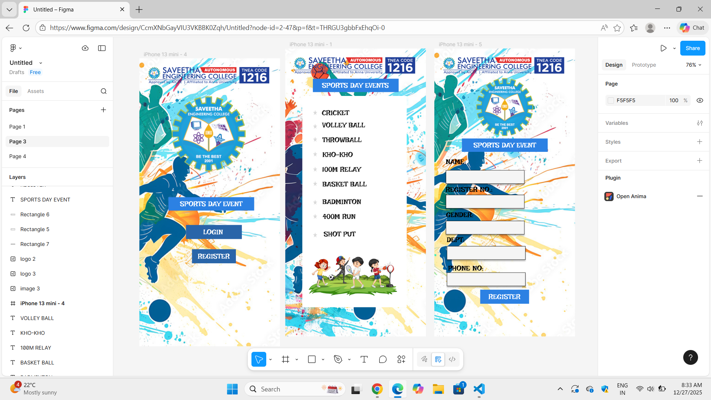

# Ex08 Event Registration Web Application
## Date:27/12/2025

## AIM:
To design, develop and deploy a web application for event registration using Figma UI tool.

## UI DESIGN TOOL:
Figma

## DESIGN STEPS:

### Step 1:
Use frames to represent screens or sections.

### Step 2:
Add column grids for consistent spacing and alignment.

### Step 3:
Insert shapes, text, buttons, and icons.

### Step 4:
Use Auto Layout for flexible, responsive design.

### Step 5:
Define color, text, and effect styles globally for consistency.

### Step 6:
Name layers logically and group related elements.

### Step 6:
Link frames to show navigation or interactions.

### Step 7:
Select the specific frame while generating code using Anima plugin.

## CODE:
```
<div class="Rectangle-16"></div>
<div class="Screenshot-2025-09-20-224446-3"></div>
<span class="LOGIN">
  LOGIN
</span>
<span class="REGISTER">
  REGISTER
</span>
<div class="images-1-3"></div>
<span class="SPORTS-DAY-EVENTS">
  SPORTS DAY EVENTS
</span>
<div class="Rectangle-17"></div>
<div class="b6fbe26651d5ef86efd15f7bf30e0f7-7"></div>
.Screenshot-2025-09-20-224446-3 {
  width: 373px;
  height: 99px;
  margin: 17px 17px 70px 16px;
}
.images-1-3 {
  width: 97px;
  height: 97px;
  margin: 70px 164px 18px 145px;
}
.SPORTS-DAY-EVENTS {
  width: 260px;
  height: 29px;
  margin: 18px 34px 56px 112px;
  font-family: Inter;
  font-size: 16px;
  font-weight: 600;
  font-stretch: normal;
  font-style: italic;
  line-height: normal;
  letter-spacing: normal;
  text-align: left;
  color: #ff0a0a;
}
.Rectangle-16 {
  width: 228px;
  height: 67px;
  margin: 56px 84px 32px 94px;
  padding: 15px 69px 13px 59px;
  background-color: #d9d9d9;
}
.LOGIN {
  width: 100px;
  height: 39px;
  font-family: Inter;
  font-size: 32px;
  font-weight: 900;
  font-stretch: normal;
  font-style: italic;
  line-height: normal;
  letter-spacing: normal;
  text-align: left;
  color: #000;
}
.Rectangle-17 {
  width: 222px;
  height: 71px;
  margin: 32px 87px 0 97px;
  padding: 16px 31px 16px 30px;
  background-color: #d9d9d9;
}
.REGISTER {
  width: 161px;
  height: 39px;
  font-family: Inter;
  font-size: 32px;
  font-weight: 900;
  font-stretch: normal;
  font-style: italic;
  line-height: normal;
  letter-spacing: normal;
  text-align: left;
  color: #000;
}
.b6fbe26651d5ef86efd15f7bf30e0f7-7 {
  width: 406px;
  height: 653px;
  padding: 0 0 97px;
}
```

## OUTPUT:

## RESULT:
The program to design, develop and deploy a web application for event registration using Figma UI tool is completed successfully.
